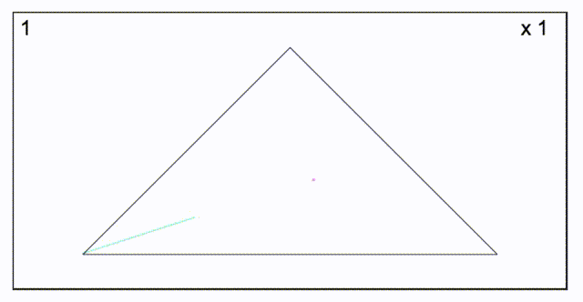

# [Chaos Game 2D](https://gregwattonville.github.io/chaos-game-2d/)

A web page allowing the exploration of the Mathematics concept [Chaos Game](https://en.wikipedia.org/wiki/Chaos_game). Built in HTML5 canvas to give visuals of the different fractals created when a random initial point is selected within a polygon.

Published Here: [gregwattonville.github.io/chaos-game-2d/](https://gregwattonville.github.io/chaos-game-2d/)

## Preview

## Background

This project was inspired by the youtube video: [Playing the Chaos Game (Sierpinski Triangle)](https://www.youtube.com/watch?v=droTYSmSGHg).

I wanted the opportunity for students and myself to explore the concept of Chaos Game and view it from different perspectives to learn and build understanding.

## Tags

HTML5, javascript, canvas, animation.

## License

[MIT](LICENSE)
