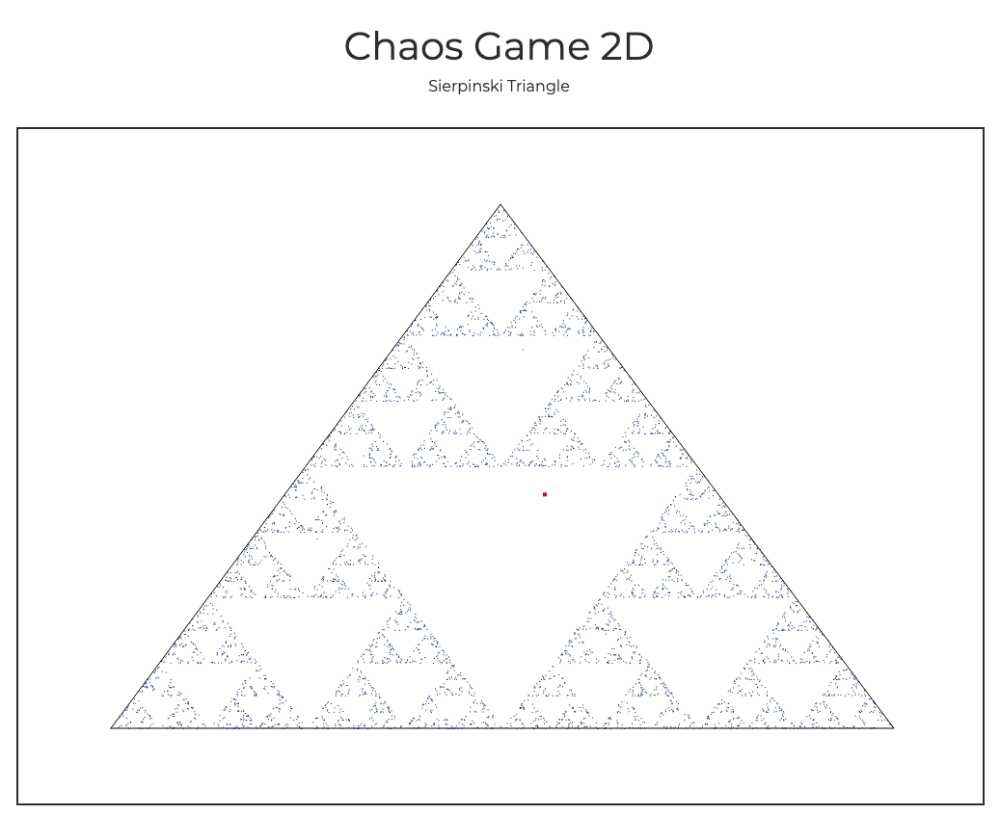

# [Chaos Game 2D](https://gregwattonville.github.io/chaos-game-2d/)

A 2D animation of the [Chaos Game](https://en.wikipedia.org/wiki/Chaos_game) mathematics method of creating a fractal. A random initial point is chosen inside the triangle followed by selecting a random corner. A new point is then placed at the midpoint between the random initial point and the random corner. Using the midpoint a new corner is chosen at random and the midpoint between these two is found creating a new point. The process is repeated greatly and the result is a Sierpinski triangle.

View it online: [gregwattonville.github.io/chaos-game-2d/](https://gregwattonville.github.io/chaos-game-2d/)

## Preview

## Background

This project was inspired by the youtube video: [Playing the Chaos Game (Sierpinski Triangle)](https://www.youtube.com/watch?v=droTYSmSGHg).

As a teacher, I wanted the opportunity for students to explore the methods of Chaos Game. Seeing it animated and having the opportunity to explore what happens when applied to different shapes opens up new perpectives and mathematical discorse in the classroom.

## License

[MIT](LICENSE)
